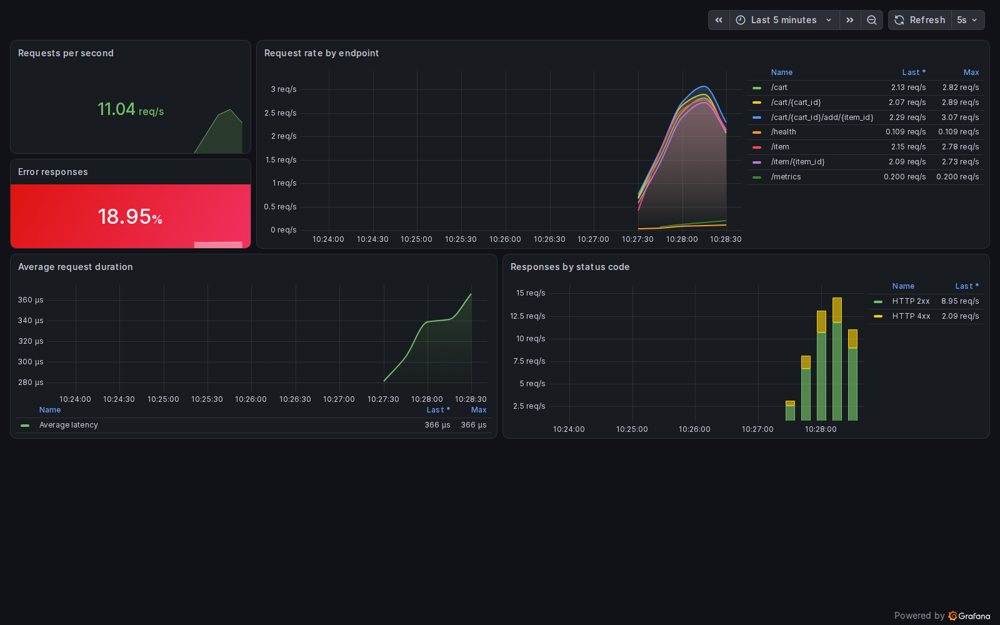

# Домашнее задание №3

Shop API из второй домашней работы запускается вместе с Prometheus и Grafana.
Метрики FastAPI доступны в `/metrics`, Prometheus собирает их каждые 5 секунд,
а Grafana автоматически подключает источник данных и готовый дашборд.

## Запуск

```bash
cd hw3
docker compose up --build -d
```

После запуска доступны:

- Shop API и Swagger: <http://localhost:8000/docs>
- метрики приложения: <http://localhost:8000/metrics>
- Prometheus: <http://localhost:9090>
- Grafana: <http://localhost:3000/d/shop-api/shop-api-monitoring>

Для наполнения графиков данными:

```bash
python load_test.py --seconds 60
```

Остановка сервисов:

```bash
docker compose down
```

## Результат


